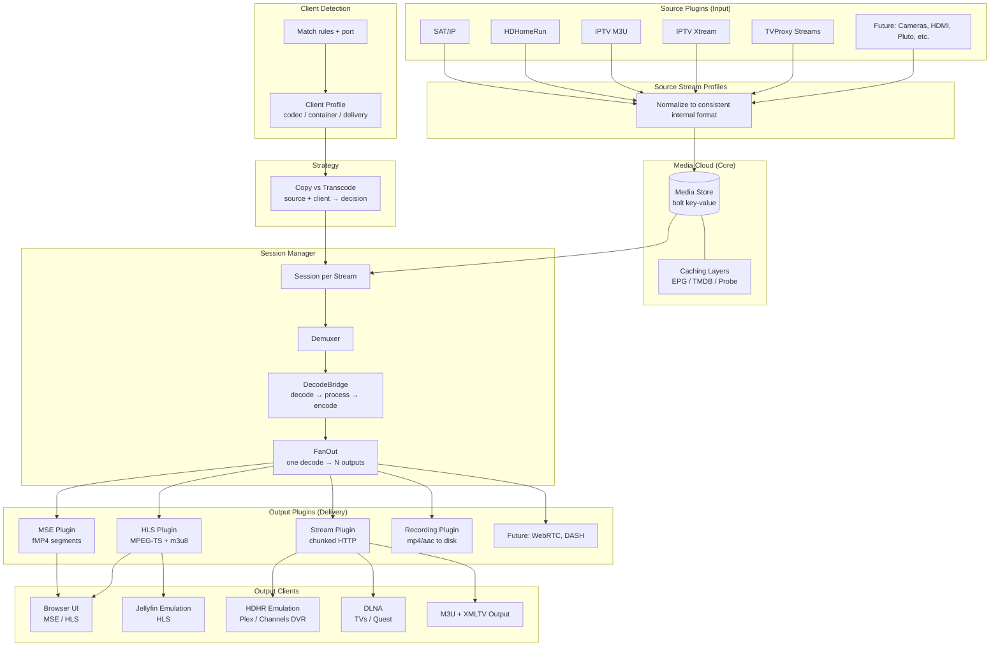
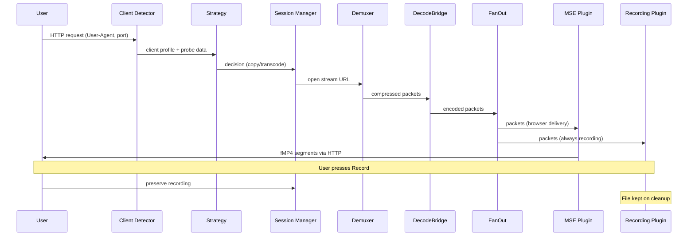
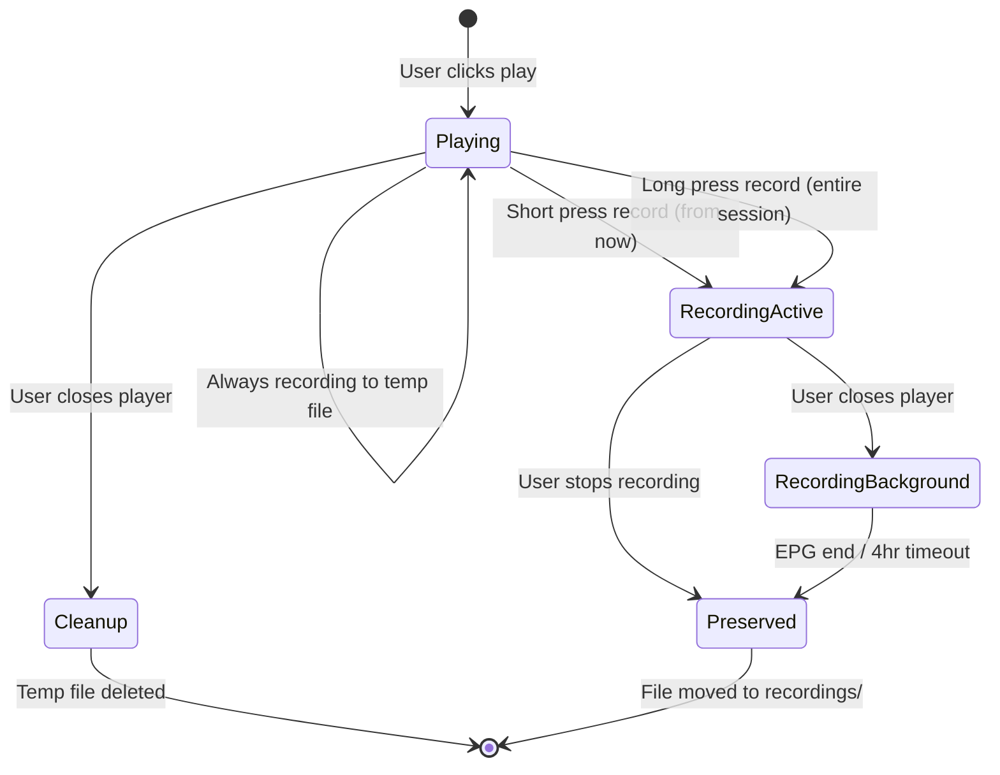

# MediaHub

Media hub connecting stream sources to playback sinks with intelligent format negotiation. Sources feed into a unified media cloud; outputs deliver to any client. Built in Go with in-process libavformat for all media processing — no subprocess management, no orphaned processes.

**50 packages | 760 tests | 15K+ impl lines | 16K+ test lines**

## Architecture



## Package Dependencies

```mermaid
graph TD
    config[config]
    media[media]
    httputil[httputil]

    store[store]
    store_bolt[store/bolt]
    cache[cache]
    cache_tmdb[cache/tmdb]

    source[source]
    source_m3u[source/m3u]
    source_hdhr[source/hdhr]
    source_satip[source/satip]

    output[output]
    output_bridge[output/bridge]
    output_mse[output/mse]
    output_hls[output/hls]
    output_stream[output/stream]
    output_record[output/record]

    av[av]
    av_probe[av/probe]
    av_demux[av/demux]
    av_demuxloop[av/demuxloop]
    av_decode[av/decode]
    av_encode[av/encode]
    av_mux[av/mux]
    av_conv[av/conv]
    av_filter[av/filter]
    av_scale[av/scale]
    av_resample[av/resample]
    av_keyframe[av/keyframe]
    av_extradata[av/extradata]
    av_selector[av/selector]

    session[session]
    strategy[strategy]
    client[client]
    channel[channel]
    epg[epg]
    auth[auth]
    m3u[m3u]
    xmltv[xmltv]
    recording[recording]
    orchestrator[orchestrator]
    connectivity[connectivity]
    connectivity_wg[connectivity/wg]
    worker[worker]
    middleware[middleware]
    api[api]

    frontend_jellyfin[frontend/jellyfin]
    frontend_hdhr[frontend/hdhr]
    frontend_dlna[frontend/dlna]

    store_bolt --> store
    store --> media
    cache_tmdb --> cache
    cache --> media

    strategy --> media
    client --> media

    source_m3u --> source
    source_hdhr --> source
    source_satip --> source
    source --> store

    output_bridge --> output
    output_mse --> output
    output_hls --> output
    output_stream --> output
    output_record --> output
    output --> media
    output_bridge --> av

    session --> output
    session --> av

    av_demux --> av_conv
    av_demuxloop --> av_demux
    av_decode --> av_conv
    av_encode --> av_conv
    av_mux --> av_conv
    av_mux --> av_keyframe
    av_mux --> av_extradata
    av_probe --> av_conv

    orchestrator --> session
    orchestrator --> strategy
    orchestrator --> recording

    api --> orchestrator
    api --> auth
    api --> channel
    api --> epg
    api --> client

    connectivity_wg --> connectivity

    frontend_jellyfin --> orchestrator
    frontend_hdhr --> channel
    frontend_dlna --> channel

    worker --> source
    worker --> epg

    style config fill:#e8f5e9
    style media fill:#e8f5e9
    style httputil fill:#e8f5e9
    style m3u fill:#e8f5e9
    style xmltv fill:#e8f5e9

    style source fill:#fff3e0
    style source_m3u fill:#fff3e0
    style source_hdhr fill:#fff3e0
    style source_satip fill:#fff3e0

    style output fill:#e3f2fd
    style output_bridge fill:#e3f2fd
    style output_mse fill:#e3f2fd
    style output_hls fill:#e3f2fd
    style output_stream fill:#e3f2fd
    style output_record fill:#e3f2fd

    style session fill:#e3f2fd
    style orchestrator fill:#e3f2fd

    style store fill:#fce4ec
    style store_bolt fill:#fce4ec
    style cache fill:#fce4ec
    style cache_tmdb fill:#fce4ec

    style strategy fill:#f3e5f5
    style client fill:#f3e5f5

    style av fill:#fffde7
    style av_probe fill:#fffde7
    style av_demux fill:#fffde7
    style av_demuxloop fill:#fffde7
    style av_decode fill:#fffde7
    style av_encode fill:#fffde7
    style av_mux fill:#fffde7
    style av_conv fill:#fffde7
    style av_filter fill:#fffde7
    style av_scale fill:#fffde7
    style av_resample fill:#fffde7
    style av_keyframe fill:#fffde7
    style av_extradata fill:#fffde7
    style av_selector fill:#fffde7
```



## Packages

### Leaf (no mediahub dependencies)

| Package | Purpose |
|---------|---------|
| `config` | Environment-based configuration |
| `media` | Shared media types: codecs, streams, probe results |
| `httputil` | HTTP utilities: headers, fetch, decompression |
| `m3u` | M3U playlist parser |
| `xmltv` | XMLTV EPG parser |

### AV Processing (libavformat wrappers, CGO)

| Package | Purpose |
|---------|---------|
| `av` | Shared AV types and constants |
| `av/conv` | Codec ID/name conversion between ffmpeg and Go |
| `av/probe` | Probe a URI to StreamInfo (video, audio, subtitles, duration) |
| `av/demux` | Open URI, read packets in a loop |
| `av/demuxloop` | Goroutine wrapper: read packets, push to pipeline sink |
| `av/decode` | Video/audio decoding (HW-aware: VideoToolbox, VAAPI, QSV) |
| `av/encode` | Video/audio encoding (HW-aware, AudioFIFO for frame buffering) |
| `av/mux` | Fragmented MP4, stream mux (MPEG-TS/MP4), HLS muxer |
| `av/filter` | Deinterlace filter (yadif) |
| `av/scale` | Video scaling (resolution ceiling) |
| `av/resample` | Audio resampling (channel downmix, sample rate conversion) |
| `av/keyframe` | Keyframe tracking for segment boundaries |
| `av/extradata` | H.264/H.265 SPS/PPS/VPS extraction for codec_data |
| `av/selector` | Audio track selection (language preference, skip AD, prefer AAC) |

### Storage and Caching

| Package | Purpose |
|---------|---------|
| `store` | Persistence interfaces (streams, channels, EPG, settings, users) |
| `store/bolt` | BoltDB-backed implementation |
| `cache` | Caching layer interfaces |
| `cache/tmdb` | TMDB metadata cache (posters, backdrops, metadata) |

### Source Plugins (Input)

| Package | Purpose |
|---------|---------|
| `source` | Source plugin interface + registry + discovery interface |
| `source/m3u` | M3U + Xtream Codes source plugin |
| `source/hdhr` | HDHomeRun source plugin |
| `source/satip` | SAT>IP source plugin |

### Output Plugins (Delivery)

| Package | Purpose |
|---------|---------|
| `output` | Output plugin interface + FanOut + registry |
| `output/bridge` | DecodeBridge: decode, process (deinterlace/scale/resample), encode |
| `output/mse` | MSE plugin: fMP4 segments for browser playback |
| `output/hls` | HLS plugin: MPEG-TS segments + m3u8 playlist |
| `output/stream` | Stream plugin: chunked HTTP (MPEG-TS/MP4) |
| `output/record` | Recording plugin: MP4/AAC to disk |

### Domain Logic

| Package | Purpose |
|---------|---------|
| `channel` | Channel management and numbering |
| `client` | Client detection (User-Agent + port) and profile resolution |
| `strategy` | Copy vs transcode decision engine (source + client profile) |
| `epg` | EPG data management and enrichment |
| `recording` | Recording lifecycle, scheduling, intent persistence |
| `auth` | JWT authentication, user management |
| `connectivity` | Connectivity abstractions |
| `connectivity/wg` | WireGuard tunnel management (per-source routing) |

### Orchestration

| Package | Purpose |
|---------|---------|
| `session` | Session manager: one session per stream, consumer tracking, FanOut |
| `orchestrator` | Playback + recording orchestration, ties strategy to sessions |
| `worker` | Background workers (M3U refresh, EPG refresh, SSDP discovery) |

### Frontend Emulation

| Package | Purpose |
|---------|---------|
| `frontend/jellyfin` | Jellyfin server emulation (login, browsing, HLS playback) |
| `frontend/hdhr` | HDHomeRun emulation (Plex, Channels DVR) |
| `frontend/dlna` | DLNA MediaServer (SSDP, ContentDirectory, ConnectionManager) |

### HTTP Layer

| Package | Purpose |
|---------|---------|
| `api` | HTTP handlers, routes, server setup |
| `middleware` | JWT auth middleware, request logging |

## Data Flow



## Recording Flow



## Key Principles

1. **Modularity protects working code.** Each component has clean boundaries. Changing one output plugin cannot break another.
2. **The media cloud is the heart.** Everything else is a plugin — inputs feed it, outputs consume it.
3. **One decode, many outputs.** Decoded frames are the shared resource. FanOut distributes to recording + delivery simultaneously.
4. **Recording is always happening.** The record button just preserves what is already being written.
5. **Recordings are input sources.** Playing back a recording goes through the normal pipeline.
6. **Sessions keyed by stream.** Multiple users watching the same stream share one session (one decode).

## Plugin Systems

MediaHub is extensible through five plugin registries:

| System | Interface | Implementations |
|--------|-----------|-----------------|
| **Source** | `source.Plugin` | M3U, Xtream Codes, HDHomeRun, SAT>IP |
| **Output** | `output.Plugin` | MSE, HLS, Stream, Recording |
| **Cache** | `cache.Cache` | TMDB metadata, EPG, probe results |
| **Connectivity** | `connectivity.Tunnel` | WireGuard (per-source routing) |
| **Store** | `store.Store` | BoltDB (default) |

Adding a new source or output is: implement the interface, register in the plugin registry.

## Build

Requires Go 1.26+ and ffmpeg development libraries (libavformat, libavcodec, libavutil, libavfilter, libswscale, libswresample).

```bash
CGO_ENABLED=1 go build -o ./mediahub ./cmd/mediahub/
```

## Test

```bash
# All tests (pure Go packages)
go test ./pkg/...

# AV library tests (requires ffmpeg dev libs)
CGO_ENABLED=1 go test ./pkg/av/...

# Frontend smoke test
node web/dist/smoke_test.js
```

## Run

```bash
TVPROXY_USER_AGENT="Mozilla/5.0 (Windows NT 10.0; Win64; x64) AppleWebKit/537.36" \
TVPROXY_RECORD_DIR=/tmp/recordings \
TVPROXY_VOD_OUTPUT_DIR=/tmp/recordings \
TVPROXY_BASE_URL=http://192.168.0.111 \
./mediahub
```

| Port | Service |
|------|---------|
| 8080 | API + Web UI |
| 8096 | Jellyfin emulation |

Default credentials: `admin` / `admin`

## Docker

```bash
docker run -d \
  -p 8080:8080 \
  -p 8096:8096 \
  -v /path/to/config:/config \
  -v /path/to/recordings:/recordings \
  -e TVPROXY_BASE_URL=http://your-ip \
  gavinmcnair/mediahub:latest
```

Hardware acceleration (Intel QSV/VAAPI, NVIDIA, AMD) is supported in the Docker image. Pass `--device /dev/dri` for Intel/AMD or `--gpus all` for NVIDIA.
