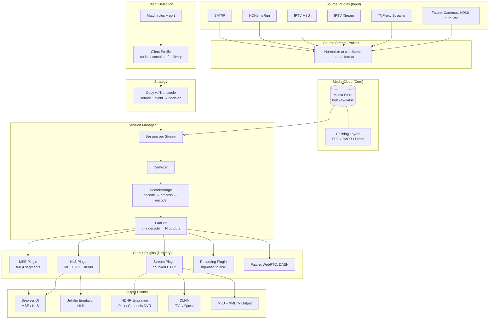
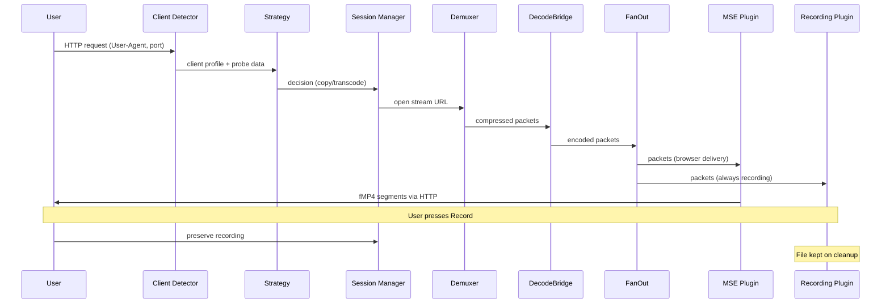
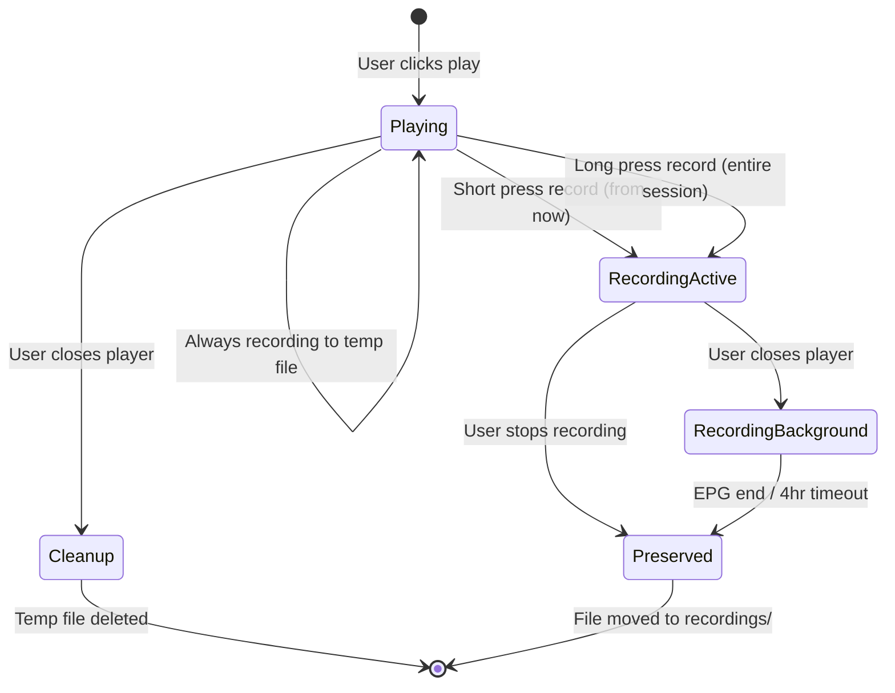

# MediaHub

Media hub connecting stream sources to playback sinks with intelligent format negotiation. Sources feed into a unified media cloud, outputs deliver to any client.

## Architecture



## Package Map

```
pkg/
  source/     Source plugin interfaces + registry
  output/     Output plugin interfaces + FanOut + registry
  media/      Shared media types (codecs, streams, probe)
  store/      Persistence interfaces + in-memory impl
  session/    Session manager (one session per stream, FanOut)
  config/     Environment-based configuration
  strategy/   Copy vs transcode decision engine
  client/     Client detection + profile resolution
```

## Data Flow



## Recording Flow



## Key Principles

1. **Modularity protects working code.** Each component has clean boundaries. Changing one output plugin cannot break another.
2. **The media cloud is the heart.** Everything else is a plugin — inputs feed it, outputs consume it.
3. **One decode, many outputs.** Decoded frames are the shared resource. FanOut distributes to recording + delivery.
4. **Recording is always happening.** The record button just preserves what's already being written.
5. **Recordings are input sources.** Playing back a recording goes through the normal pipeline.
6. **Sessions keyed by stream.** Multiple users watching the same stream share one session (one decode).

## Build & Test

```bash
go test ./pkg/... -v
```
